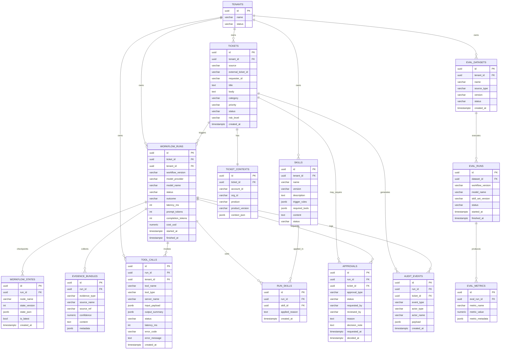

# AI Customer Support Resolution Orchestrator 数据与 API 设计

## 1. 文档目标

本文档补充项目的两个核心设计面：

- 数据库 ER 关系设计
- API request / response schema

该文档与以下文件配套：

- `customer-support-resolution-orchestrator-tech-spec.md`
- `customer-support-resolution-orchestrator-architecture.md`

## 2. 数据库设计原则

### 2.1 设计目标

- 支持多租户隔离
- 支持工单全生命周期追踪
- 支持 agent run 回放和 checkpoint 恢复
- 支持 tool call、skill、approval、audit 的关联分析
- 支持离线评测与版本回归

### 2.2 建模原则

- 业务主实体与运行时实体分离
- workflow state 以快照方式持久化
- tool call 和 audit event 做细粒度记录
- eval 相关实体与线上 run 解耦

## 3. ER 图



## 4. 关键实体说明

## 4.1 Tickets

这是业务主实体，代表一个待处理工单。  
不直接存 agent 中间状态，只保留业务主字段和最终状态。

## 4.2 Workflow Runs

每次工单进入 agent 编排都会生成一条 run。  
这样同一个工单可以有多次重跑、回放、审批后恢复。

## 4.3 Workflow States

该表用于 checkpoint 与 resume。  
为了支持长任务和人工审批恢复，需要保存节点级状态快照。

## 4.4 Tool Calls

这是 AI 应用后端最重要的审计表之一。  
一旦面试官追问“你怎么知道 agent 做了什么”，这张表就是答案。

## 4.5 Skills / Run Skills

`skills` 存版本化 skill 定义。  
`run_skills` 用来记录某次 run 实际应用了哪些 skill。

## 4.6 Approvals

审批流实体，用来支撑：

- 高风险动作审批
- 人工确认后恢复 workflow
- 审批 SLA 分析

## 4.7 Eval Datasets / Eval Runs / Eval Metrics

这三张表支撑离线评测与版本回归，避免项目只停留在“感觉更好”。

## 5. 索引与查询建议

### 5.1 高频查询

- 按 ticket 查看最新 run
- 按 run 查看 tool calls、audit、approval
- 按 tenant 查看近期失败任务
- 按 workflow_version / model_name 查看 eval 指标

### 5.2 推荐索引

`tickets`

- `(tenant_id, external_ticket_id)`
- `(tenant_id, status, created_at desc)`
- `(tenant_id, priority, created_at desc)`

`workflow_runs`

- `(ticket_id, started_at desc)`
- `(tenant_id, started_at desc)`
- `(tenant_id, outcome, started_at desc)`

`tool_calls`

- `(run_id, created_at)`
- `(tenant_id, tool_name, created_at desc)`

`audit_events`

- `(run_id, created_at)`
- `(ticket_id, created_at)`

## 6. API 设计原则

### 6.1 API 风格

- REST 为主
- 异步任务通过 run_id 查询状态
- 高风险动作必须显式审批接口
- trace 与 audit 独立查询

### 6.2 返回结构约定

统一响应结构建议：

```json
{
  "request_id": "req_123",
  "data": {},
  "error": null
}
```

错误响应：

```json
{
  "request_id": "req_123",
  "data": null,
  "error": {
    "code": "approval_required",
    "message": "Manual approval is required for this action."
  }
}
```

## 7. API Schema 设计

## 7.1 POST /tickets/intake

### 用途

接收标准化工单，创建 ticket 与 workflow run。

### Request

```json
{
  "tenant_id": "tenant_acme",
  "source": "zendesk",
  "external_ticket_id": "zd_100287",
  "requester": {
    "id": "u_983",
    "email": "ops@acme.com",
    "name": "Alice"
  },
  "account_context": {
    "account_id": "acc_189",
    "org_id": "org_73",
    "plan_type": "enterprise",
    "product": "iam-cloud",
    "product_version": "v5.2.1"
  },
  "ticket": {
    "title": "SSO login stopped working after certificate rotation",
    "body": "Our users cannot login after we rotated certs this morning. Need urgent help.",
    "attachments": [
      {
        "type": "text",
        "name": "error-snippet.txt",
        "content_ref": "s3://bucket/obj-1"
      }
    ]
  },
  "metadata": {
    "channel": "email",
    "language": "en"
  }
}
```

### Response

```json
{
  "request_id": "req_001",
  "data": {
    "ticket_id": "tkt_001",
    "run_id": "run_001",
    "status": "accepted",
    "workflow_status": "triaging"
  },
  "error": null
}
```

## 7.2 GET /tickets/{ticket_id}

### 用途

查看工单当前处理状态与最终建议。

### Response

```json
{
  "request_id": "req_002",
  "data": {
    "ticket_id": "tkt_001",
    "status": "approval_pending",
    "category": "sso_issue",
    "priority": "p1",
    "risk_level": "high",
    "latest_run": {
      "run_id": "run_001",
      "status": "paused",
      "outcome": "approval_required"
    },
    "proposed_resolution": {
      "diagnosis_summary": "Likely certificate mapping mismatch after rotation.",
      "confidence": 0.84,
      "recommended_action": "Validate IdP metadata and update SP certificate fingerprint.",
      "user_reply": "We identified a likely certificate mapping issue...",
      "internal_notes": "Evidence from KB article kb_882 and audit log entry lg_139."
    }
  },
  "error": null
}
```

## 7.3 GET /runs/{run_id}

### 用途

查看单次 agent run 的执行结果和状态。

### Response

```json
{
  "request_id": "req_003",
  "data": {
    "run_id": "run_001",
    "ticket_id": "tkt_001",
    "status": "completed",
    "outcome": "accepted",
    "workflow_version": "v1.2.0",
    "model_name": "gpt-5.2",
    "latency_ms": 12843,
    "token_usage": {
      "prompt_tokens": 9234,
      "completion_tokens": 1184
    },
    "selected_skills": [
      {
        "name": "enterprise-sso-troubleshooting",
        "version": "1.0.3"
      }
    ]
  },
  "error": null
}
```

## 7.4 GET /runs/{run_id}/trace

### 用途

查看节点执行时间线、tool call、审计链路。

### Response

```json
{
  "request_id": "req_004",
  "data": {
    "run_id": "run_001",
    "trace_id": "trace_88",
    "timeline": [
      {
        "node": "triage",
        "status": "completed",
        "started_at": "2026-03-28T10:00:01Z",
        "finished_at": "2026-03-28T10:00:04Z"
      },
      {
        "node": "investigator",
        "status": "completed",
        "started_at": "2026-03-28T10:00:04Z",
        "finished_at": "2026-03-28T10:00:11Z"
      }
    ],
    "tool_calls": [
      {
        "tool_name": "kb.search",
        "status": "success",
        "latency_ms": 212
      },
      {
        "tool_name": "crm.lookup",
        "status": "success",
        "latency_ms": 84
      }
    ],
    "audit_event_count": 17
  },
  "error": null
}
```

## 7.5 POST /approvals/{approval_id}/decision

### 用途

人工 reviewer 对高风险动作做决策。

### Request

```json
{
  "reviewed_by": "bob@company.com",
  "decision": "approve",
  "decision_note": "Evidence is sufficient. Proceed with guided resolution."
}
```

### Response

```json
{
  "request_id": "req_005",
  "data": {
    "approval_id": "apr_001",
    "status": "approved",
    "resume_required": true,
    "run_id": "run_001"
  },
  "error": null
}
```

## 7.6 POST /runs/{run_id}/resume

### 用途

审批完成后恢复 workflow。

### Request

```json
{
  "triggered_by": "system",
  "resume_from": "verifier"
}
```

### Response

```json
{
  "request_id": "req_006",
  "data": {
    "run_id": "run_001",
    "status": "resumed"
  },
  "error": null
}
```

## 7.7 GET /admin/tool-calls

### 用途

运维或平台管理员查看工具调用情况。

### Query 参数

- tenant_id
- tool_name
- status
- start_time
- end_time

### Response

```json
{
  "request_id": "req_007",
  "data": {
    "items": [
      {
        "tool_call_id": "tc_001",
        "run_id": "run_001",
        "tool_name": "billing.history",
        "tool_type": "native",
        "status": "success",
        "latency_ms": 145
      }
    ],
    "page": 1,
    "page_size": 20,
    "total": 1
  },
  "error": null
}
```

## 7.8 POST /admin/evals/run

### 用途

触发离线评测任务。

### Request

```json
{
  "dataset_name": "support-golden-v1",
  "workflow_version": "v1.2.0",
  "model_name": "gpt-5.2",
  "skill_set_version": "support-skillset-2026-03-28"
}
```

### Response

```json
{
  "request_id": "req_008",
  "data": {
    "eval_run_id": "eval_001",
    "status": "queued"
  },
  "error": null
}
```

## 7.9 GET /admin/evals/{eval_run_id}

### Response

```json
{
  "request_id": "req_009",
  "data": {
    "eval_run_id": "eval_001",
    "status": "completed",
    "metrics": {
      "classification_accuracy": 0.87,
      "grounded_resolution_rate": 0.82,
      "unsafe_auto_action_rate": 0.00,
      "average_latency_ms": 11432
    }
  },
  "error": null
}
```

## 8. Pydantic Schema 建议

## 8.1 IntakeRequest

```python
from pydantic import BaseModel, Field
from typing import Any


class Requester(BaseModel):
    id: str
    email: str
    name: str | None = None


class AccountContext(BaseModel):
    account_id: str
    org_id: str | None = None
    plan_type: str | None = None
    product: str | None = None
    product_version: str | None = None


class AttachmentRef(BaseModel):
    type: str
    name: str
    content_ref: str


class TicketPayload(BaseModel):
    title: str
    body: str
    attachments: list[AttachmentRef] = Field(default_factory=list)


class IntakeRequest(BaseModel):
    tenant_id: str
    source: str
    external_ticket_id: str
    requester: Requester
    account_context: AccountContext
    ticket: TicketPayload
    metadata: dict[str, Any] = Field(default_factory=dict)
```

## 8.2 ResolutionResponse

```python
class ProposedResolution(BaseModel):
    diagnosis_summary: str
    confidence: float
    recommended_action: str
    user_reply: str
    internal_notes: str


class TicketStatusResponse(BaseModel):
    ticket_id: str
    status: str
    category: str | None = None
    priority: str | None = None
    risk_level: str | None = None
    proposed_resolution: ProposedResolution | None = None
```

## 8.3 ApprovalDecisionRequest

```python
class ApprovalDecisionRequest(BaseModel):
    reviewed_by: str
    decision: str
    decision_note: str | None = None
```

## 9. API 版本演进建议

- `v1`：ticket intake、status、run trace、approval、resume
- `v2`：operator feedback、manual override、dataset labeling
- `v3`：application-level customization、multi-workflow routing

## 10. 面试展示重点

讲这个文档时，重点不是“我画了 ER 图”，而是：

- 我知道 AI 应用后端不是只有 prompt 和 agent
- 我知道如何把业务主实体与运行时实体拆开
- 我知道为什么需要 checkpoint 表、tool_calls 表、audit_events 表
- 我知道如何让审批、评测、回放、追踪落到数据模型和 API 里
