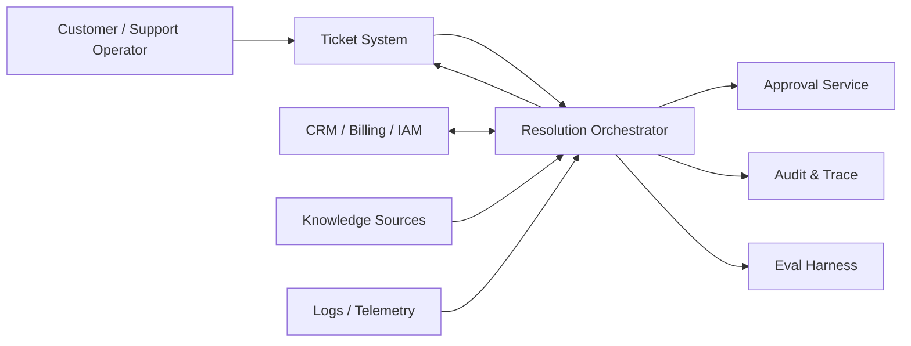
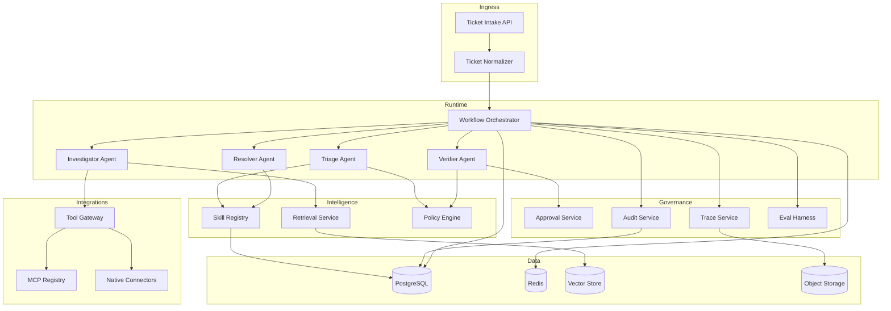
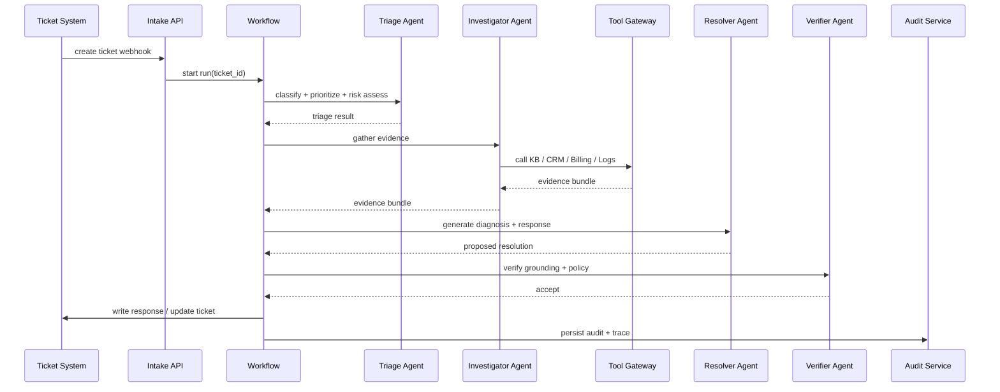
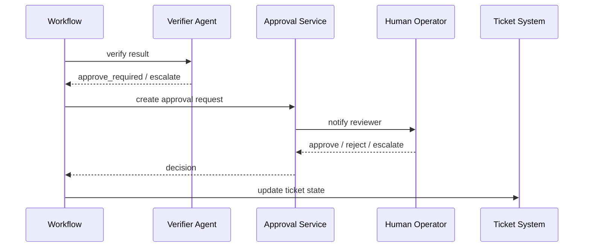

# AI Customer Support Resolution Orchestrator 架构设计

## 1. 文档目标

本文档细化 `AI Customer Support Resolution Orchestrator` 的系统架构，重点覆盖：

- 系统边界与组件关系
- 核心业务流程与时序
- 模块拆解与职责划分
- 数据表设计
- API、事件流与部署建议

## 2. 设计目标

### 2.1 功能目标

- 接收多来源工单
- 自动分类、判优先级、判风险
- 检索知识与历史案例
- 调用内部工具收集证据
- 生成有依据的解决建议
- 对高风险场景执行审批或升级
- 回写工单并保留审计链路

### 2.2 非功能目标

- 可恢复：长任务可中断恢复
- 可审计：所有关键决策有日志
- 可治理：工具调用、技能、审批可配置
- 可评测：支持离线回放和指标对比
- 可扩展：支持新 ticket source、connector、skill

## 3. 系统边界

### 3.1 系统输入

- ticket title
- ticket body
- requester profile
- account / org context
- product / version context
- historical interaction summary

### 3.2 系统输出

- structured diagnosis
- user-facing response
- internal support notes
- suggested next action
- escalation or approval request
- audit log
- evaluation record

## 4. 总体架构图

### 4.1 上下文架构

### 4.2 逻辑组件架构

## 5. 核心业务时序

### 5.1 自动处理时序

### 5.2 升级与审批时序

## 6. 模块拆解

## 6.1 Ticket Intake API

职责：

- 接收 webhook / manual submit / batch import
- 验证签名和来源
- 标准化 ticket payload
- 创建运行记录

输入：

- 原始 ticket event

输出：

- normalized_ticket
- run_id

关键点：

- 幂等处理
- 去重
- source-specific mapping

## 6.2 Ticket Normalizer

职责：

- 统一字段模型
- 清洗 HTML / email quote / attachment references
- 补充 tenant、product、requester 基础上下文

输出字段：

- normalized_subject
- normalized_body
- requester_profile
- account_context
- product_context

## 6.3 Workflow Orchestrator

职责：

- 驱动 agent graph
- 保存 checkpoint
- 控制状态流转
- 承担 retry / resume / timeout

状态转换：

- `new -> triaged -> investigating -> resolving -> verifying -> completed`
- `verifying -> approval_pending`
- `verifying -> escalated`
- `approval_pending -> resumed`

## 6.4 Triage Agent

职责：

- 分类
- 优先级判断
- 风险判断
- 选择候选 skill
- 决定所需工具集合

输出示例：

- category = `billing_dispute`
- priority = `p2`
- risk_level = `medium`
- skills = `["billing-dispute-handling"]`
- required_tools = `["crm.lookup", "billing.history", "kb.search"]`

## 6.5 Investigator Agent

职责：

- 召回知识库资料
- 调工具拉业务上下文
- 构造 evidence bundle
- 标记信息缺口

设计要求：

- 所有证据必须带 source 和 confidence
- 支持工具调用失败降级
- 支持只读工具隔离

## 6.6 Resolver Agent

职责：

- 生成 diagnosis
- 生成 user-facing response
- 生成 operator notes
- 给出推荐动作

输出结构：

- diagnosis_summary
- probable_root_cause
- confidence
- recommended_action
- user_reply
- internal_notes

## 6.7 Verifier Agent

职责：

- 检查 grounding
- 检查 policy 是否允许自动处理
- 检查风险边界
- 决定 accept / approval_required / escalate / insufficient_evidence

校验规则：

- 无证据不得高置信输出
- 高风险动作必须审批
- 证据与结论必须可追溯

## 6.8 Retrieval Service

职责：

- 文档索引
- 历史工单索引
- hybrid retrieval
- reranking
- citation formatting

输入：

- query
- tenant_id
- context filters

输出：

- ranked chunks
- sources
- evidence snippets

## 6.9 Skill Registry

职责：

- 管理 skill 元数据
- 提供 skill 查询与版本控制
- 记录 skill 与应用、租户、流程的绑定关系

接口：

- get_applicable_skills(context)
- resolve_skill_version(name, tenant_id)
- list_required_tools(skill)

## 6.10 Tool Gateway

职责：

- 统一工具注册和调用
- 工具 schema 校验
- 权限控制
- timeout / retry / circuit breaker
- 输出标准化

工具类型：

- native connector
- MCP tool
- internal microservice tool

## 6.11 MCP Registry

职责：

- 管理可用 MCP servers
- 维护 server 健康状态与版本
- 对外暴露支持的 tool/resource 清单

注意点：

- 并非所有工具都必须走 MCP
- MCP 主要用于标准化复用和跨 host 接入

## 6.12 Approval Service

职责：

- 生成审批单
- 分发给 reviewer
- 接收审批结果
- 触发 workflow resume

## 6.13 Audit & Trace Service

职责：

- 记录每一步 decision
- 记录 tool call history
- 记录 skill / model / prompt version
- 支持回放

## 6.14 Eval Harness

职责：

- 离线数据集回放
- 指标统计
- 版本对比
- regression alert

## 7. 数据流设计

### 7.1 主数据流

1. Ticket event 进入 intake
2. 标准化为统一 ticket schema
3. 创建 run record
4. workflow 执行并不断更新 state
5. retrieval / tools 返回证据
6. verifier 产出决策
7. 审批或回写 ticket
8. 写入 audit / trace / eval

### 7.2 辅助数据流

- 文档 ingestion -> vector index
- 历史工单导入 -> retrieval corpus
- tool metadata -> tool registry
- skill 发布 -> skill registry
- run logs -> eval dataset

## 8. 数据表设计

## 8.1 tickets

用途：存储标准化工单主记录。

| 字段 | 类型 | 说明 |
|---|---|---|
| id | uuid pk | 内部主键 |
| tenant_id | uuid | 租户 ID |
| source | varchar | 来源系统 |
| external_ticket_id | varchar | 外部工单 ID |
| requester_id | varchar | 请求人 ID |
| requester_email | varchar | 请求人邮箱 |
| title | text | 标题 |
| body | text | 标准化正文 |
| category | varchar | 预测类别 |
| priority | varchar | 优先级 |
| status | varchar | 当前状态 |
| risk_level | varchar | 风险级别 |
| created_at | timestamptz | 创建时间 |
| updated_at | timestamptz | 更新时间 |

索引建议：

- `(tenant_id, external_ticket_id)`
- `(tenant_id, status)`
- `(tenant_id, priority, created_at desc)`

## 8.2 ticket_contexts

用途：存储工单扩展上下文快照。

| 字段 | 类型 | 说明 |
|---|---|---|
| id | uuid pk | 主键 |
| ticket_id | uuid fk | 关联 tickets |
| account_id | varchar | 账户 ID |
| org_id | varchar | 组织 ID |
| product | varchar | 产品线 |
| product_version | varchar | 版本 |
| plan_type | varchar | 套餐 |
| context_json | jsonb | 结构化上下文 |
| created_at | timestamptz | 创建时间 |

## 8.3 workflow_runs

用途：记录每次 agent 运行。

| 字段 | 类型 | 说明 |
|---|---|---|
| id | uuid pk | run ID |
| ticket_id | uuid fk | 对应工单 |
| tenant_id | uuid | 租户 ID |
| workflow_version | varchar | 工作流版本 |
| model_provider | varchar | 模型供应商 |
| model_name | varchar | 模型名称 |
| status | varchar | running/completed/failed |
| outcome | varchar | accept/approval/escalate |
| started_at | timestamptz | 开始时间 |
| finished_at | timestamptz | 结束时间 |
| latency_ms | int | 总耗时 |
| prompt_tokens | int | 输入 tokens |
| completion_tokens | int | 输出 tokens |
| cost_usd | numeric | 估算成本 |

索引建议：

- `(ticket_id, started_at desc)`
- `(tenant_id, started_at desc)`
- `(tenant_id, outcome)`

## 8.4 workflow_states

用途：存储 checkpoint / resume 所需状态快照。

| 字段 | 类型 | 说明 |
|---|---|---|
| id | uuid pk | 主键 |
| run_id | uuid fk | 关联 run |
| node_name | varchar | 当前节点 |
| state_version | int | 状态版本 |
| state_json | jsonb | 序列化状态 |
| is_latest | bool | 是否最新 |
| created_at | timestamptz | 创建时间 |

## 8.5 evidence_bundles

用途：记录 Investigator 聚合的证据。

| 字段 | 类型 | 说明 |
|---|---|---|
| id | uuid pk | 主键 |
| run_id | uuid fk | 关联 run |
| evidence_type | varchar | kb/crm/logs/billing |
| source_name | varchar | 来源 |
| source_ref | varchar | 来源引用 |
| confidence | numeric | 置信度 |
| content | text | 证据摘要 |
| metadata | jsonb | 补充信息 |
| created_at | timestamptz | 创建时间 |

索引建议：

- `(run_id, evidence_type)`

## 8.6 tool_calls

用途：记录所有工具调用。

| 字段 | 类型 | 说明 |
|---|---|---|
| id | uuid pk | 主键 |
| run_id | uuid fk | 关联 run |
| tenant_id | uuid | 租户 ID |
| tool_name | varchar | 工具名 |
| tool_type | varchar | native/mcp |
| server_name | varchar | MCP server 名称或 connector 名 |
| input_payload | jsonb | 输入 |
| output_summary | jsonb | 输出摘要 |
| status | varchar | success/failed/timeout |
| latency_ms | int | 耗时 |
| error_code | varchar | 错误码 |
| error_message | text | 错误信息 |
| created_at | timestamptz | 创建时间 |

索引建议：

- `(run_id, created_at)`
- `(tenant_id, tool_name, created_at desc)`

## 8.7 skills

用途：存储 skill 元数据和内容。

| 字段 | 类型 | 说明 |
|---|---|---|
| id | uuid pk | 主键 |
| tenant_id | uuid | 租户 |
| name | varchar | skill 名 |
| version | varchar | 版本 |
| description | text | 描述 |
| trigger_rules | jsonb | 触发规则 |
| required_tools | jsonb | 依赖工具 |
| content | text | skill 内容 |
| status | varchar | active/inactive |
| created_at | timestamptz | 创建时间 |

唯一约束建议：

- `(tenant_id, name, version)`

## 8.8 run_skills

用途：记录某次 run 使用了哪些 skill。

| 字段 | 类型 | 说明 |
|---|---|---|
| id | uuid pk | 主键 |
| run_id | uuid fk | run |
| skill_id | uuid fk | skill |
| applied_reason | text | 使用原因 |
| created_at | timestamptz | 创建时间 |

## 8.9 approvals

用途：记录审批流。

| 字段 | 类型 | 说明 |
|---|---|---|
| id | uuid pk | 主键 |
| run_id | uuid fk | run |
| ticket_id | uuid fk | ticket |
| approval_type | varchar | auto-action / escalation / refund |
| status | varchar | pending/approved/rejected |
| requested_by | varchar | 系统或人 |
| reviewed_by | varchar | reviewer |
| reason | text | 申请原因 |
| decision_note | text | 审批备注 |
| requested_at | timestamptz | 发起时间 |
| decided_at | timestamptz | 处理时间 |

## 8.10 audit_events

用途：记录关键审计事件。

| 字段 | 类型 | 说明 |
|---|---|---|
| id | uuid pk | 主键 |
| run_id | uuid fk | run |
| ticket_id | uuid fk | ticket |
| event_type | varchar | triage/tool_call/policy/approval/writeback |
| actor_type | varchar | system/agent/human |
| actor_name | varchar | actor 名称 |
| payload | jsonb | 事件详情 |
| created_at | timestamptz | 创建时间 |

## 8.11 eval_datasets

用途：管理评测数据集。

| 字段 | 类型 | 说明 |
|---|---|---|
| id | uuid pk | 主键 |
| name | varchar | 数据集名 |
| tenant_id | uuid | 租户 |
| source_type | varchar | synthetic/historical |
| version | varchar | 版本 |
| status | varchar | active/inactive |
| created_at | timestamptz | 创建时间 |

## 8.12 eval_runs

用途：记录离线评测执行。

| 字段 | 类型 | 说明 |
|---|---|---|
| id | uuid pk | 主键 |
| dataset_id | uuid fk | 数据集 |
| workflow_version | varchar | 工作流版本 |
| model_name | varchar | 模型 |
| skill_set_version | varchar | skill 版本集合 |
| started_at | timestamptz | 开始时间 |
| finished_at | timestamptz | 结束时间 |
| status | varchar | running/completed/failed |

## 8.13 eval_metrics

用途：记录评测指标。

| 字段 | 类型 | 说明 |
|---|---|---|
| id | uuid pk | 主键 |
| eval_run_id | uuid fk | 评测运行 |
| metric_name | varchar | 指标名 |
| metric_value | numeric | 指标值 |
| metric_metadata | jsonb | 元数据 |

## 9. API 设计

### 9.1 外部 API

#### `POST /tickets/intake`

用途：

- 接收标准化工单或 webhook 映射后工单

返回：

- ticket_id
- run_id
- status

#### `GET /tickets/{ticket_id}`

返回：

- 当前状态
- 最终建议
- 审批信息

#### `GET /runs/{run_id}/trace`

返回：

- node timeline
- tool calls
- audit events

#### `POST /approvals/{approval_id}/decision`

输入：

- approve / reject / escalate

#### `POST /runs/{run_id}/resume`

用途：

- 审批后恢复 workflow

### 9.2 内部服务接口

- Retrieval Service RPC
- Tool Gateway RPC
- Policy check RPC
- Skill resolution RPC
- Eval run trigger RPC

## 10. 事件流设计

推荐事件主题：

- `ticket.received`
- `workflow.started`
- `workflow.node.completed`
- `tool.called`
- `approval.requested`
- `approval.decided`
- `ticket.resolved`
- `eval.completed`

## 11. 缓存与队列策略

### 11.1 Redis 用途

- run session cache
- short-term retrieval cache
- approval pending markers
- distributed locks

### 11.2 队列划分

- intake queue
- workflow queue
- tool execution queue
- approval callback queue
- eval queue

## 12. 可靠性设计

### 12.1 超时控制

- retrieval timeout
- tool timeout
- run-level timeout

### 12.2 重试策略

- 幂等读操作允许自动重试
- 非幂等写操作禁止无条件重试
- 失败原因必须结构化记录

### 12.3 降级策略

- 外部工具失败时降级为知识检索模式
- 无法自动决策时自动升级人工

## 13. 安全设计

### 13.1 权限

- tenant isolation
- role-based tool access
- write tool approval gate

### 13.2 数据保护

- PII masking
- audit encryption
- connector secret rotation

## 14. 部署设计

### 14.1 推荐部署组件

- FastAPI API Pods
- Worker Pods
- PostgreSQL
- Redis
- Vector DB
- Object Storage
- Monitoring stack

### 14.2 环境划分

- local dev
- staging
- production

## 15. 可量化目标

- 自动处理低风险工单比例 > 40%
- grounded resolution rate > 80%
- 高风险工单越权自动关闭 = 0
- 工单 trace 完整率 = 100%
- 关键流程可恢复率 > 95%

## 16. 面试展示建议

如果用这个项目面试，重点突出：

- 你设计的是“处理流程系统”，不是“聊天机器人”
- 你为什么选择 multi-agent 而不是单 agent
- 你如何划分 MCP 与 native connector
- 你如何做审批、审计、评测和恢复
- 你如何把 retrieval、workflow、policy、tooling 串成一个后端系统
