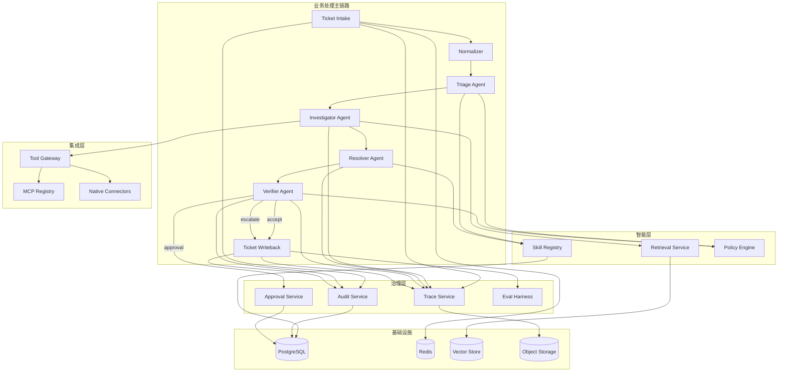

# AI Customer Support Resolution Orchestrator 模块拆解与实施路线

## 1. 文档目标

本文档用于补足项目的实施视角，覆盖：

- 模块拆解图
- 各模块职责与边界
- MVP 范围
- 分阶段里程碑
- 风险点与验收标准

配套文档：

- `customer-support-resolution-orchestrator-tech-spec.md`
- `customer-support-resolution-orchestrator-architecture.md`
- `customer-support-resolution-data-api-design.md`

## 2. 项目拆解原则

拆解原则如下：

- 先做完整闭环，再做平台化增强
- 先做高价值只读能力，再做高风险写入能力
- 先做单租户可演示系统，再做多租户和治理增强
- 先做可运行 workflow，再做离线 eval 与高级运维能力

## 3. 模块拆解图

## 4. 模块拆解

## 4.1 Ticket Intake & Normalizer

### 职责

- 接收 ticket webhook 或内部 API 请求
- 统一 ticket schema
- 做去重、幂等、来源映射
- 创建初始 workflow run

### 输入

- Zendesk / Salesforce / 自定义表单 / 邮件网关事件

### 输出

- normalized ticket
- ticket_id
- run_id

### 验收标准

- 相同 external_ticket_id 不会重复创建
- 异常输入能返回清晰错误码
- 所有工单进入统一 schema

## 4.2 Workflow Orchestrator

### 职责

- 维护状态图
- 执行 agent 节点
- checkpoint / resume
- timeout / retry / failover

### 关键边界

- 不直接处理业务工具细节
- 不直接决定业务 policy
- 只负责编排和状态流转

### 验收标准

- 支持 `new -> completed`
- 支持 `approval_pending -> resumed`
- 节点失败后有可追踪错误

## 4.3 Triage Agent

### 职责

- 分类
- 优先级判断
- 风险判断
- 选择 skill
- 确定候选工具集

### 输出

- category
- priority
- risk_level
- selected_skills
- requested_tools

### 验收标准

- 常见工单类别识别准确
- 高风险场景不漏判
- 触发的 skills 和工具可解释

## 4.4 Retrieval Service

### 职责

- 管理知识索引
- hybrid search
- rerank
- 返回带来源的证据片段

### 数据来源

- FAQ
- 产品文档
- 历史工单
- 事故复盘

### 验收标准

- 查询结果带 source ref
- 支持 tenant filter
- 支持 top-k 可配置

## 4.5 Investigator Agent

### 职责

- 调 retrieval
- 调业务工具
- 汇总 evidence bundle
- 标记缺失信息

### 输出

- evidence_bundle
- candidate_causes
- missing_information

### 验收标准

- 所有证据有来源
- 工具失败时能降级
- 证据结构化，可供 resolver 使用

## 4.6 Tool Gateway

### 职责

- 工具注册
- 工具调用
- schema 校验
- timeout / retry / circuit breaker
- 权限校验

### 子模块

- Native connector runner
- MCP adapter
- tool result normalizer

### 验收标准

- 所有工具调用有统一日志
- 非授权工具无法调用
- tool 调用结果结构一致

## 4.7 Skill Registry

### 职责

- skill 管理与版本化
- skill 触发规则查询
- skill 与流程绑定

### 验收标准

- 支持按 tenant + name + version 查询
- 支持记录每次 run 实际应用 skill
- 支持快速替换 skill 版本做评测

## 4.8 Resolver Agent

### 职责

- 生成 diagnosis
- 生成 user response
- 生成 internal notes
- 输出 recommended_action

### 验收标准

- 输出结构固定
- 回答与证据链一致
- 不出现无依据的高置信结论

## 4.9 Verifier Agent

### 职责

- grounding 检查
- policy 检查
- 自动处理边界检查
- 决定 accept / approval / escalate

### 验收标准

- 高风险动作不会直接自动执行
- 证据不足时不会放行
- 审批与升级路径清晰

## 4.10 Approval Service

### 职责

- 创建审批单
- 分发 reviewer
- 记录 decision
- 驱动 workflow resume

### 验收标准

- 审批状态可追踪
- 审批后可恢复原 workflow
- 决策有审计记录

## 4.11 Audit / Trace Service

### 职责

- 记录关键事件
- 保存 tool calls 和节点执行时间线
- 支持 replay

### 验收标准

- 任意 run 可回放
- 任意关键决策可追溯
- trace 与 ticket、run、approval 可关联

## 4.12 Eval Harness

### 职责

- 离线数据集执行
- 指标统计
- 回归比较

### 验收标准

- 可以比较模型版本
- 可以比较 skill 版本
- 可以比较 retrieval 配置

## 5. MVP 范围

## 5.1 MVP 目标

MVP 不追求平台化完备，而追求一个完整可演示闭环：

- 接收工单
- 自动分类
- 检索知识
- 调 2-3 个业务工具
- 生成解决建议
- 对高风险场景要求人工审批
- 回写工单状态
- 记录 trace 和 audit

## 5.2 MVP 包含

- 单租户
- 单 ticket source
- 4 个 agent：
  - triage
  - investigator
  - resolver
  - verifier
- Retrieval Service
- Tool Gateway
- 2-3 个 native connectors
- 1 个最小 MCP server
- Skill Registry 基础版
- Approval Service 基础版
- 基础 trace / audit
- 最小离线 eval

## 5.3 MVP 不包含

- 多租户复杂权限体系
- 丰富 operator UI
- 多工作流市场
- 大规模自动 AB test
- 高复杂度异步调度编排
- 大量外部系统接入

## 5.4 MVP 成功标准

- 跑通一个真实支持场景闭环
- 可展示审批与恢复
- 可展示 skill 触发
- 可展示 MCP 与 native connector 并存
- 可展示至少一份离线 eval 结果

## 6. 分阶段里程碑

## Milestone 1：单工单闭环原型

目标：

- 能接收工单并跑完整体 workflow

交付物：

- ticket intake API
- normalized schema
- 4 agent workflow
- run status 查询

验收：

- 单次请求可从 intake 跑到 final resolution

## Milestone 2：知识与证据系统

目标：

- 让输出具备 evidence grounding

交付物：

- 文档 ingestion pipeline
- vector index
- retrieval service
- evidence bundle 结构

验收：

- response 中可引用来源

## Milestone 3：工具接入层

目标：

- 打通内部系统能力

交付物：

- tool gateway
- 2-3 个 native connectors
- 1 个 MCP server demo
- 工具调用日志

验收：

- investigator 能稳定调用业务工具

## Milestone 4：技能与策略层

目标：

- 固化领域处理逻辑

交付物：

- skill registry
- 2-3 个 support skills
- policy engine baseline

验收：

- triage 能基于上下文选择 skill

## Milestone 5：审批与恢复

目标：

- 引入可控自动化边界

交付物：

- approval service
- pause / resume workflow
- 审批审计记录

验收：

- 高风险 case 必须审批后才能继续

## Milestone 6：可观测性与评测

目标：

- 形成生产化闭环

交付物：

- trace timeline
- audit events
- golden dataset
- offline eval report

验收：

- 可回放 run
- 可展示至少 4 个核心指标

## 7. 风险与应对

## 7.1 风险：多 agent 设计过重

应对：

- MVP 控制在 4 个 agent
- 每个 agent 输出固定结构
- 严禁无业务理由扩展 agent 数量

## 7.2 风险：MCP 增加复杂度但价值不明显

应对：

- 仅保留 1 个演示型 MCP server
- 其他高频内部工具优先 native connector

## 7.3 风险：retrieval 质量不稳定

应对：

- 从窄领域文档开始
- 加 metadata filter 和 rerank
- 先做 evidence bundle，再做更复杂召回

## 7.4 风险：评测做不起来

应对：

- 先做 20-50 条黄金样本
- 先看分类、groundedness、升级正确率
- 不一开始就追求复杂评测平台

## 8. 演示方案建议

最适合演示的路径：

1. 输入一个复杂支持工单
2. 展示 triage 分类结果
3. 展示 retrieval 和工具证据
4. 展示 resolver 生成的结构化方案
5. 展示 verifier 将其判定为 approval required
6. 展示审批通过后 workflow resume
7. 展示最终回写和 trace

这样能同时展示：

- agent workflow
- retrieval
- tools
- MCP
- skills
- approval
- audit
- eval mindset

## 9. 面试表达建议

如果面试官问“这个项目最大的难点是什么”，建议回答：

“难点不是把 LLM 接上，而是把工单处理这种高约束业务流程拆成可恢复、可审计、可评测的后端系统。我重点解决的是四件事：workflow orchestration、evidence grounding、tool/MCP integration，以及 approval + audit 这条安全边界。” 
